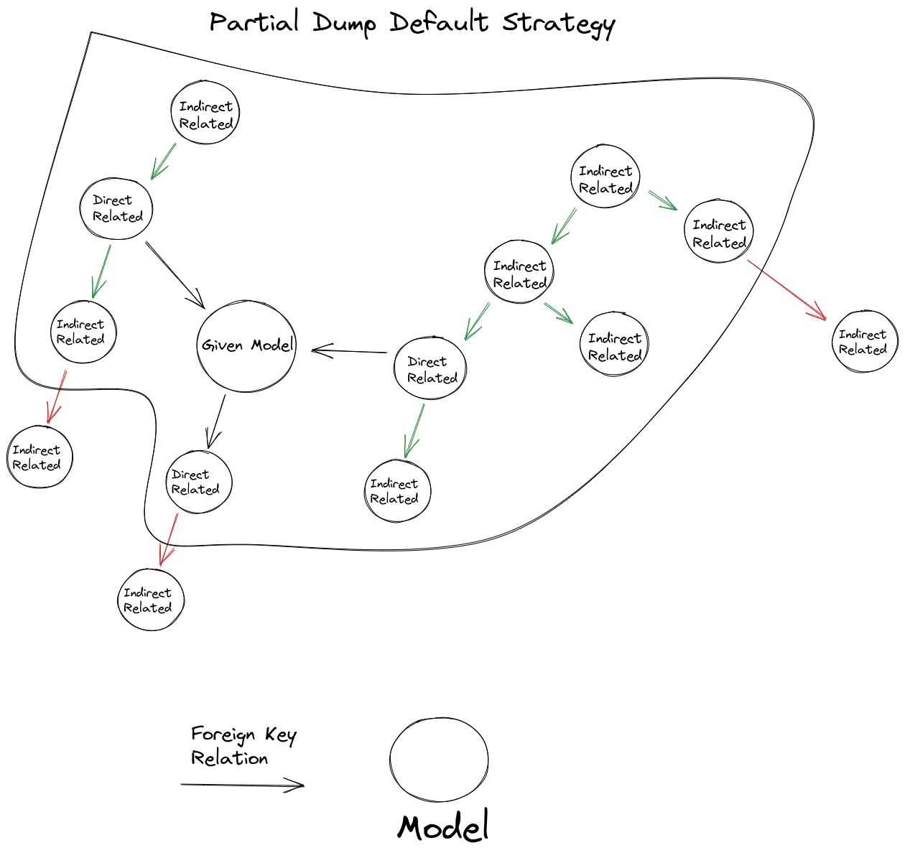

## Mongoose Partial Dump

A partial dumper helper for a mongoose environment.

This package will aid developers to create partial dumps of a mongoDB database using mongoose. Making possible to easily dump only documents related to specifics functionalities of a bigger project.

## Table of Contents

-  [Dumper](#dumper)
   -  [Anonymization](#anonymize-type-enum)
-  [Restore](#restore)
-  [Installation](#installation)

### Installation

-  `npm install -g mongoose-partial-dumper`
-  `npm install mongoose-partial-dumper`
-  `yarn add mongoose-partial-dump`

## DUMPER

Responsible for write dump files or log dump json

### Usage

-  Create a partial-dump.config.{ts, js} file
-  `yarn partial dump <collectionName> [id] [outputDir]`

### Strategies

#### Default

#### Config

| Install:        | type:        | Description:                                   | Required: | example:                                   |
| --------------- | ------------ | ---------------------------------------------- | --------- | ------------------------------------------ |
| db              | object       | database input configurations                  | **true**  | {url: ''}                                  |
| db.url          | string       | database url configurations                    | **true**  | <mongodb://localhost:27017/dumper-example> |
| models          | Model<any>[] | Mongoose Model list                            | **true**  | {models: [User]}                           |
| getPayload      | function     | Function that returns a Model.find() Object    | **false** | {\_id: <ObjectId>, company: <ObjectId>}    |
| outputDir       | string       | database input configurations                  | **false** | 'dump.json'                                |
| anonymize       | object       | anonymize info object, data anonymization      | **false** | {field: 'name', type: 'name'}              |
| anonymize.field | string       | input to dumper know which fields to anonymize | **false** | 'name', 'phone', 'address', etc...         |
| anonymize.type  | enum         | input to dumper know which type the field is   | **false** | 'name', 'phone', 'address', etc...         |

### Anonymize Type Enum

-  name
-  phone
-  address
-  avatar
-  birthdate
-  creationDate
-  companyName

#### CLI

##### Arguments

| Input:         | type:  | Description:                                                            | Required: | example:                   |
| -------------- | ------ | ----------------------------------------------------------------------- | --------- | -------------------------- |
| collectionName | string | Main collection name to be base of your dump                            | **true**  | 'User'                     |
| id             | string | If given, dump will priorize this input to return all documents related | **false** | '60b40699c73c9095df00c22b' |
| outputDir      | string | Path to file to be created or overwriten                                | **false** | 'dump.json'                |

##### Options

| Input: | type:  | Description:                                                                           | Required: | example: |
| ------ | ------ | -------------------------------------------------------------------------------------- | --------- | -------- |
| --log  | string | If this option is given, no file will be generated, instead a log will show on console | **false** | 'User'   |

## RESTORE

Responsible for read dump files and import to your database

### Usage

-  Create a partial-dump.config.{ts, js} file
-  `yarn partial restore [inputDir]`

#### Config

| Install: | type:        | Description:                                            | Required: | example:                                   |
| -------- | ------------ | ------------------------------------------------------- | --------- | ------------------------------------------ |
| db       | object       | database input configurations                           | **true**  | {url: ''}                                  |
| db.url   | string       | database url configurations                             | **true**  | <mongodb://localhost:27017/dumper-example> |
| models   | Model<any>[] | Mongoose Model list                                     | **true**  | {models: [User]}                           |
| inputDir | string       | Path to file to be restored (imported to your database) | **false** | 'dump.json'                                |

#### CLI

##### Arguments

| Input:   | type:  | Description:                                            | Required: | example:    |
| -------- | ------ | ------------------------------------------------------- | --------- | ----------- |
| inputDir | string | Path to file to be restored (imported to your database) | **false** | 'dump.json' |

### Examples

-  Mongoose partial dumper example - https://github.com/Streeterxs/mongoose-partial-dump-example (use the scripts in package.json to make your tests easier)
